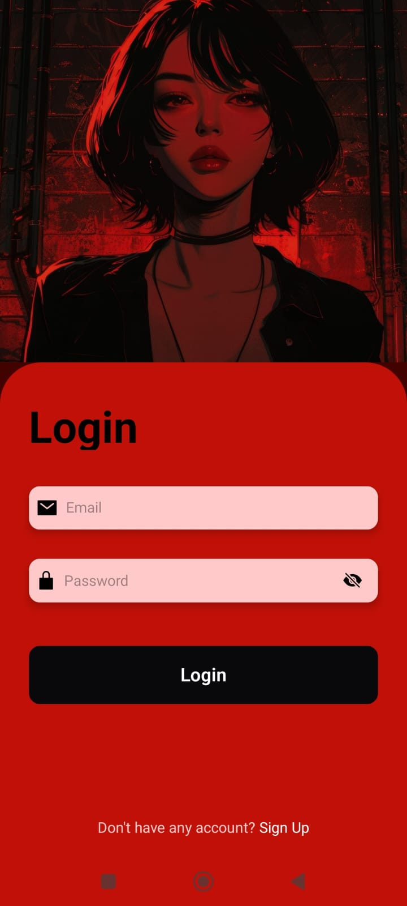
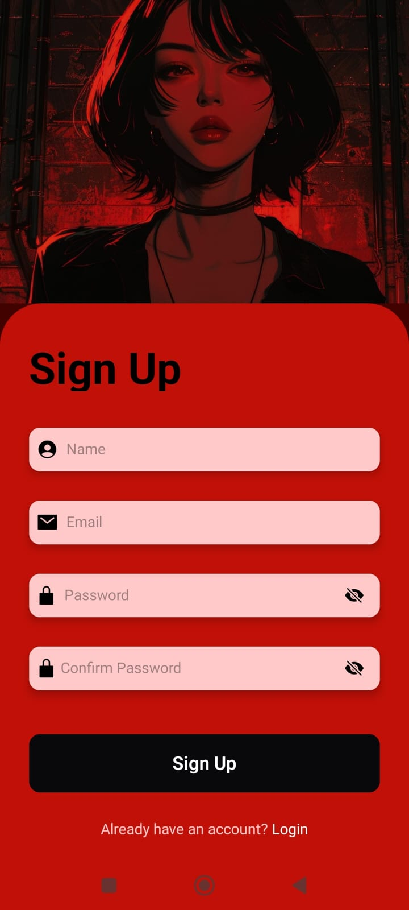
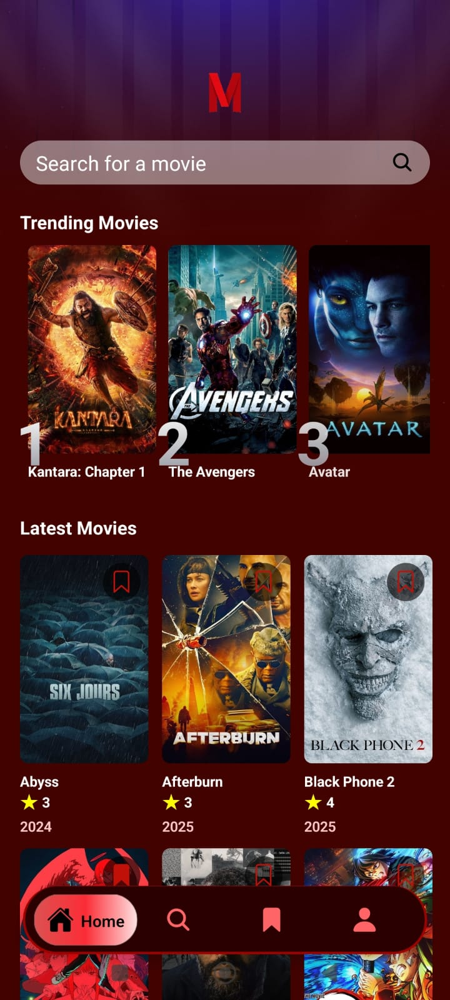
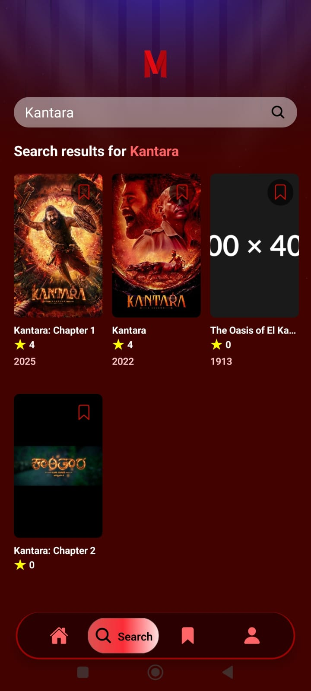
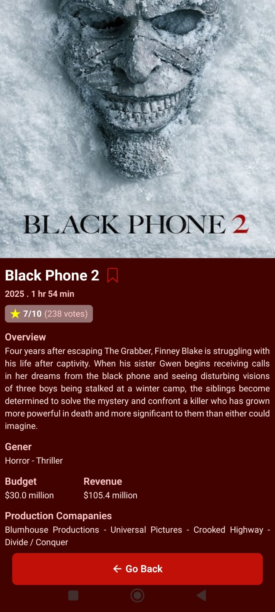
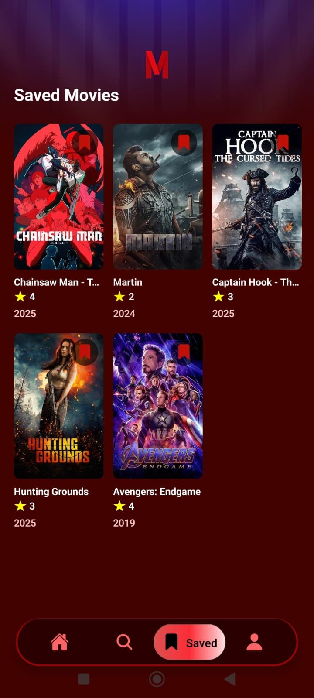
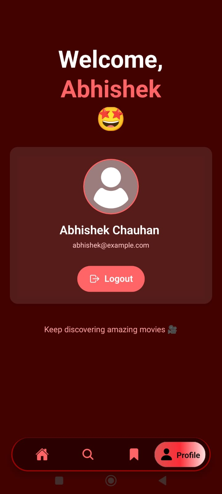

# 🎬 Melody

<div align="center">
**A modern, feature-rich mobile application for discovering, searching, and managing your favorite movies.**
</div>

---

## 📱 Screenshots

<div align="center">

### Authentication
 

### Home


### Search & Details
 

### Saved Movies & Profile
 

</div>

---

## ✨ Features

### 🔐 **Authentication**
- Secure email/password registration and login
- Session management with persistent login state
- Protected routes and automatic redirects
- User profile management

### 🎥 **Movie Discovery**
- Browse popular and latest movies
- Real-time search with debounced API calls
- Detailed movie information (ratings, budget, revenue, genres)
- High-quality posters and backdrop images

### 🔥 **Trending Analytics**
- Top 5 trending movies based on user searches
- Real-time search tracking and analytics
- Visual ranking system with gradient badges
- Automatic search count updates

### 📚 **Bookmark System**
- Save/unsave movies to your collection
- Persistent local storage with AsyncStorage
- Quick access to saved movies
- Visual bookmark indicators on all movie cards

### 🎨 **Modern UI/UX**
- Custom animated tab bar navigation
- Smooth transitions and loading states
- Responsive grid layouts
- Safe area handling for all devices
- Dark theme with custom color palette

---

## 🛠 Tech Stack

### **Frontend**
- **React Native** (0.81.5) - Cross-platform mobile framework
- **Expo** (54.0.22) - Development platform and tooling
- **TypeScript** (5.9.2) - Type-safe development
- **Expo Router** (6.0.14) - File-based routing
- **NativeWind** (4.2.1) - Tailwind CSS for React Native

### **Backend & Services**
- **Appwrite** - Backend-as-a-Service
  - User authentication
  - Database for trending analytics
  - Session management
- **TMDB API** - The Movie Database API for movie data
- **AsyncStorage** - Local data persistence

### **UI Components & Libraries**
- `@expo/vector-icons` - Ionicons icon set
- `react-native-safe-area-context` - Safe area management
- `@react-native-masked-view` - Masked views for rankings
- `react-native-gesture-handler` - Touch interactions
- `react-navigation` - Navigation infrastructure

### **Development Tools**
- ESLint - Code linting
- Prettier - Code formatting
- TypeScript interfaces - Type definitions

---

## 🚀 Getting Started

### Prerequisites

- Node.js (v18 or higher)
- npm or yarn
- Expo CLI
- iOS Simulator (Mac) or Android Emulator

### Installation

1. **Clone the repository**
   ```bash
   git clone https://github.com/magnum1122/Melody
   cd melody
   ```

2. **Install dependencies**
   ```bash
   npm install
   # or
   yarn install
   ```

3. **Set up environment variables**
   
   Create a `.env` file in the root directory:
   ```env
   EXPO_PUBLIC_MOVIE_API_KEY=your_tmdb_api_key
   EXPO_PUBLIC_APPWRITE_PROJECT_ID=your_appwrite_project_id
   EXPO_PUBLIC_APPWRITE_DATABASE_ID=your_appwrite_database_id
   EXPO_PUBLIC_APPWRITE_COLLECTION_ID=your_appwrite_collection_id
   ```

4. **Get API Keys**
   
   - **TMDB API**: Register at [themoviedb.org](https://www.themoviedb.org/settings/api)
   - **Appwrite**: 
     - Create a project at [cloud.appwrite.io](https://cloud.appwrite.io)
     - Create a database and collection with the following attributes:
       - `searchTerm` (String)
       - `movie_id` (Integer)
       - `title` (String)
       - `count` (Integer)
       - `poster_url` (String, URL)

5. **Run the app**
   ```bash
   # Start Expo development server
   npm start

   # Run on iOS
   npm run ios

   # Run on Android
   npm run android
   ```

---

## 📁 Project Structure

```
moviesmood/
├── app/
│   ├── (protected)/          # Protected routes (auth required)
│   │   ├── (tabs)/          # Bottom tab navigation
│   │   │   ├── _layout.tsx  # Tab bar configuration
│   │   │   ├── index.tsx    # Home screen
│   │   │   ├── search.tsx   # Search screen
│   │   │   ├── saved.tsx    # Saved movies screen
│   │   │   └── profile.tsx  # User profile screen
│   │   ├── _layout.tsx      # Protected layout wrapper
│   │   └── movies/[id].tsx  # Dynamic movie details
│   ├── utils/
│   │   └── asyncstorage.ts  # Local storage utilities
│   ├── _layout.tsx          # Root layout
│   ├── Login.tsx            # Login screen
│   ├── SignUp.tsx           # Registration screen
│   └── global.css           # Global styles
├── components/
│   ├── Loading.tsx          # Loading component
│   ├── MovieCard.tsx        # Movie card component
│   ├── SearchBar.tsx        # Search input component
│   └── TrendingCard.tsx     # Trending movie card
├── constants/
│   ├── icons.ts             # Icon exports
│   └── images.ts            # Image exports
├── interfaces/
│   └── interfaces.d.ts      # TypeScript interfaces
├── services/
│   ├── api.ts               # TMDB API integration
│   ├── appwrite/
│   │   ├── AppwriteContext.tsx  # Auth context
│   │   ├── appwrite.ts          # Database operations
│   │   └── appwriteauth.ts      # Auth operations
│   └── useFetch.ts          # Custom fetch hook
├── assets/                   # Images and icons
├── package.json
├── tsconfig.json
└── tailwind.config.js
```

---

## 🏗 Architecture

### **File-Based Routing**
Uses Expo Router for intuitive, file-system-based routing with nested layouts and protected routes.

### **Service Layer Pattern**
- **API Service**: Centralized TMDB API calls
- **Appwrite Services**: Authentication and database operations
- **AsyncStorage Utils**: Local storage abstraction layer

### **State Management**
- **Context API**: Global authentication state
- **Custom Hooks**: `useFetch` hook for API state management
- **Local State**: React hooks for component-level state

### **Component Architecture**
- Functional components with TypeScript
- Reusable, composable components
- Props validation with interfaces
- Separation of concerns

---

## 🔑 Key Features Implementation

### **Custom useFetch Hook**
```typescript
const { data, loading, error, refetch, reset } = useFetch(
  () => fetchMovies({ query: searchQuery }),
  false // autoFetch
);
```

### **Debounced Search**
```typescript
useEffect(() => {
  const timeoutId = setTimeout(async () => {
    if (searchQuery.trim()) {
      await loadMovies();
    } else {
      reset();
    }
  }, 800);
  return () => clearTimeout(timeoutId);
}, [searchQuery]);
```

### **Protected Routes**
```typescript
if (!isLoggedIn) {
  return <Redirect href="/Login" />;
}
```

---

## 📊 Database Schema

### **Appwrite Collection: Trending Movies**
```typescript
{
  searchTerm: string      // Search query
  movie_id: number        // TMDB movie ID
  title: string          // Movie title
  count: number          // Search count
  poster_url: string     // Movie poster URL
}
```

### **AsyncStorage Keys**
- `@saved_movies`: Array of saved movie IDs

---

## 🎨 Design System

### **Color Palette**
- Primary: `#2B0000` (Dark red)
- Accent: `#C11007` / `#FF6467` (Red shades)
- UI Colors: Custom gray scale (`ui_100` - `ui_700`)
- Background: Dark theme with gradient overlays

### **Typography**
- Headings: Bold, large sizes
- Body: Regular weight
- Custom font weights via TailwindCSS

---

## 📝 License

This project is licensed under the MIT License

---

## 👤 Author

**Abhishek Chauhan**

- GitHub: [@magnum1122](https://github.com/magnum1122)
- LinkedIn: [Abhishek Chauhan](https://www.linkedin.com/in/abhishek-chauhan447/)
- Email: abhishekchauhan4871@gmailcom

---

## 🙏 Acknowledgments

- [TMDB](https://www.themoviedb.org/) for providing the movie database API
- [Appwrite](https://appwrite.io/) for the excellent BaaS platform
- [Expo](https://expo.dev/) for the amazing development tools
- [React Native](https://reactionnative.dev/) community for the great ecosystem

<div align="center">

**⭐ Star this repository if you found it helpful!**

Made with ❤️ using React Native

</div>